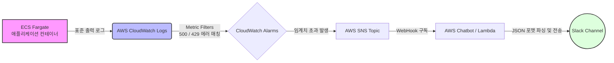

### ☁️ 클라우드 배포 모니터링 아키텍처 제안 (CloudWatch & Slack 연동)

현재 AWS ECS + Fargate 환경 애플리케이션 로그는 기본적으로 **CloudWatch Logs**로 수집되고 있습니다. 이를 활용하여 지정한 시간 내 특정 에러 키워드가 발생하면 **CloudWatch Alarms**를 작동시키고, **SNS** 및 **AWS Chatbot (또는 AWS Lambda)**을 거쳐 **Slack**으로 전송하는 아키텍처를 구성하겠습니다.

#### 1. 에러 감지 및 알람 구성 방안 (가이드)
- **대상 지표 필터 생성 (Metric Filters):**
  - **500 에러 필터:** 로그 그룹(`/ecs/shortcut-backend`)에서 `"[v51c8a7b] Error during analysis"` 혹은 `"status_code=500"` 문자열 검색
  - **429 토큰 초과 필터:** `"[429]"` 또는 `"Rate limit reached"` 등 OpenAI 429 관련 로그 패턴 검색
- **CloudWatch Alarms 세팅:**
  - 평가 기간(예: 1분) 내 필터링된 로그 누적 발생 횟수가 N회(예: 1회 이상)를 초과할 경우 알람(ALARM) 상태로 전환되도록 임계치 설정.

#### 2. 알람 파이프라인 아키텍처 다이어그램 (장기 플랜)

### 📋 PM 에이전트 전달용 기술 백로그 (복사해서 PM에게 전달하세요)
- **Epic: 서비스 안정성 및 모니터링 (Op & Monitoring)**
  - [ ] CloudWatch Logs Metric Filter 생성 스크립트 작성 (500 Error, 429 Token Limit)
  - [ ] CloudWatch Alarms 구성 및 임계치 설정 (1분 내 에러 1회 이상)
  - [ ] AWS SNS Topic 생성 및 Slack WebHook 엔드포인트 구독 연결 로직 구성 (Lambda 또는 Chatbot 사용)
  - [ ] 테스트/스테이징 환경에서 에러 강제 발생을 통한 Slack 알림 수신 검증
